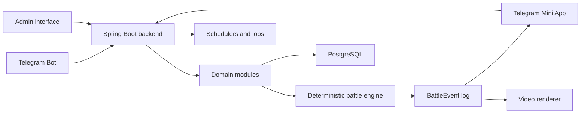

# Frontline Nations

Frontline Nations is a Telegram-first asynchronous military strategy game in which players complete short daily operations and contribute resources to weekly alliance fronts.

The repository contains a command-only MVP bot backed by Kotlin, Spring Boot, and PostgreSQL. The broader target product and architecture are described in [Documents/Frontline_TZ_v0.1_RU.docx](Documents/Frontline_TZ_v0.1_RU.docx). Mini App functionality is intentionally deferred.


## Play

Open [@frontline_nations_bot](https://t.me/frontline_nations_bot) and use:

- `/start` — register and choose an alliance with inline buttons
- `/battle` — choose an operation, map entry, first objective, and behavior doctrine for the active group
- `/army` or `/hangar` — switch between three presets and select equipment within the CP limit
- `/shop` — inspect illustrated equipment cards and buy or craft a unit
- `/upgrade` — improve an owned unit from level 1 to 5
- `/development` or `/research` — spend Research Points to expand command capacity
- `/profile` — inspect alliance, level progress, battle record, resources, and daily orders
- `/front` — inspect the current matchup, intelligence, countdown, or published result
- `/contribute` — add or refresh an immutable snapshot of the active equipment group before the Sunday lock; the equipment is not consumed
- `/country` or `/country Serbia` — browse 250 countries and territories or search by localized name/code
- `/language` — choose English, Russian, Spanish, Brazilian Portuguese, Arabic, Indonesian, Hindi, or Turkish
- `/nickname Commander` — choose a sanitized nickname after explicit confirmation
- `/settings` — open language and profile settings
- `/help` — show command help

New accounts infer their initial language from Telegram and receive language-relevant country suggestions. The explicit language selection is retained even when Telegram later sends another interface locale. Existing accounts keep Russian until they choose another language.

## Product Principles

- A normal play session should produce a complete result in 1–3 minutes.
- Strategic depth comes from unit composition, terrain, routes, weapon ranges, behavior doctrines, modules, and campaign allocation rather than real-time micromanagement.
- Personal progression contributes to a weekly alliance war, while matchmaking, NPC garrisons, and contribution modifiers keep smaller alliances viable.
- Battles are calculated on the server. Replays visualize an immutable event log and never determine the result.
- Balance values, schedules, units, battlefields, rewards, and other content are data-driven.
- The system should scale without simulating every campaign unit as a real-time physical entity.

## Planned Experience

### Daily operations

Players receive a limited number of Combat Orders and choose one of several operations. The bot shows a compact 7×7 sector map with three entry points and three important objectives; the player orders the active group through an entry toward its first objective and selects a movement/target-priority doctrine. The deterministic engine moves individual units, resolves spotting and finite-range fire, and tracks multi-step objective capture and recapture. A battle ends when one side controls every objective or the opposing army is destroyed or routed. Operations award commander XP, credits, research points, and materials.

### Weekly campaigns

All 250 countries and territories enter 125 weekly pairings. With an empty table they are sorted by English name and paired adjacently; later rounds sort by cumulative battle rating, with English name as the stable tie-break. Contributions remain open until Sunday at 15:00 in the `Europe/Belgrade` timezone.

Each country receives a deterministic random NPC group whose actual equipment fits the first 10–25 CP category. Players reinforce their country only with snapshots of their own active equipment groups; no Credits or equipment are spent. Each matchup uses one of ten versioned 13×11 maps with five capture points and five aggregate formation classes per side. Formations move across terrain and use finite weapon ranges; artillery can fire indirectly, while aircraft still cannot strike across the whole map. A captured point grants more score when secured early. Losing it removes its retained score, and a later recapture is worth less. Destroyed enemy power and surviving allied power also score. Capturing all five points or destroying the opposing army ends the battle early; at the 48-turn limit, remaining force decides the winner first. Rating accumulates each side's battle score instead of replacing it, preventing one defeat from erasing a leading country's season.

### Progression

The command MVP now includes seven configurable equipment classes, individual owned units, three reusable combat-group presets, commander-level unlocks, purchase and lower-credit crafting recipes, and five unit levels. Every class has map movement, sight, minimum/maximum weapon range, and a fire mode in addition to its five combat statistics. Aircraft movement remains finite; attack aircraft and fighters cannot strike across the whole map. Every level adds 12% to the unit's five base statistics.

New commanders receive the specification's 10 CP starter group: two main battle tanks, one artillery unit, and one reconnaissance vehicle. Commander levels unlock six force echelons while Research Points buy command-capacity expansions from 10 to 1,000 CP. Battles are classified by actually deployed power: 10–25, 26–50, 51–100, 101–250, 251–500, and 501–1,000 CP. Large groups are simulated as homogeneous formations by equipment class and level, preserving tactical differences without creating hundreds of independent map actors. The active preset becomes an immutable input snapshot for battle resolution. Modules, branching technology choices, doctrine perks, repairs, and seasonal prestige remain planned.

## Target Architecture



The MVP currently uses:

- Kotlin and Spring Boot backend
- PostgreSQL 16+ persistence
- Telegram Bot commands and inline flows
- Docker Compose for local and production-like environments

The diagram also shows the planned Mini App, admin interface, replay stream, and optional renderer; those components are not part of the command-only MVP.

See [DOCUMENTATION.md](DOCUMENTATION.md) for module boundaries and data flow.

## Planned Repository Layout

```text
src/           Spring Boot application, migration, and tests
compose.yml    Application and PostgreSQL containers
scripts/       Telegram and deployment helpers
assets/        Brand assets, including the Telegram avatar
src/main/resources/static/assets/units/  Generated equipment-class icons
docs/          Product, architecture, and repository guidance
Documents/     Source specifications and retained project materials
```

Mini App and replay-renderer directories will be added only when those milestones begin.

## Documentation

- [Product overview](docs/product-overview.md)
- [Architecture](DOCUMENTATION.md)
- [Architecture baseline decision](docs/decisions/0001-architecture-baseline.md)
- [Localized identity and alliance catalog decision](docs/decisions/0004-localized-identity-and-alliance-catalog.md)
- [Personal equipment and tactical composition decision](docs/decisions/0005-personal-equipment-and-tactical-composition.md)
- [Spatial personal battles decision](docs/decisions/0006-spatial-personal-battles.md)
- [Command capacity and force tiers decision](docs/decisions/0007-command-capacity-and-force-tiers.md)
- [Ranked spatial weekly campaigns decision](docs/decisions/0008-ranked-spatial-weekly-campaigns.md)
- [Contributor guide](CONTRIBUTING.md)
- [Agent guide](AGENTS.md)
- [GitHub About metadata](docs/github-about.md)
- [Source specification](Documents/Frontline_TZ_v0.1_RU.docx)

## Development Status

Current phase: command-only MVP with persistent equipment progression, spatial personal operations, and ranked spatial weekly battles.

The current implementation proves localized registration and settings, a versioned 250-entry country/territory catalog, moderated nicknames, a seven-class equipment catalog, transactional bulk purchase/crafting/upgrades, three CP-limited presets, level-gated command capacity expanded with Research Points, six battle categories up to 1,000 CP, five operation offers drawn from 24 battlefields with 24 mapped variants, deterministic formation-based spatial battles with objective control, 125 rating-seeded weekly pairings on ten larger maps, a random 10–25 CP NPC equipment group for every country, non-destructive player equipment reinforcement, timed aggregate spatial resolution, capture/destruction/survival scoring, idempotent campaign rewards, and durable Telegram notifications. Graphical replays, seasonal alliance switching, modules, typed campaign assets, branching technologies, Mini App, and video rendering remain planned.

Run tests with `GRADLE_USER_HOME="$PWD/.gradle-home" ./gradlew test`. For a local Docker run, copy `.env.example` to an ignored `.env`, replace every secret, create the PostgreSQL data directory, and run `docker compose up --build`.

Production is published at [frontline-nations.tg-games.com](https://frontline-nations.tg-games.com). See [the Home Data Center runbook](docs/production/home-data-center.md).

## License

Licensed under the [Apache License 2.0](LICENSE).
