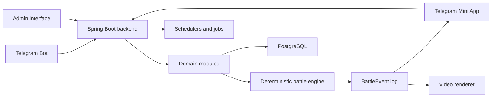

# Frontline Nations

Frontline Nations is a Telegram-first asynchronous military strategy game in which players build combat groups, complete short daily operations, and contribute campaign assets to weekly alliance battles.

The repository is at the specification stage. The target product and architecture are described in [Documents/Frontline_TZ_v0.1_RU.docx](Documents/Frontline_TZ_v0.1_RU.docx); implementation has not started yet. Product and engineering documentation in this repository summarizes that source without claiming unfinished features as shipped.

## Product Principles

- A normal play session should produce a complete result in 1–3 minutes.
- Strategic depth comes from unit composition, modules, doctrines, tactics, and campaign allocation rather than real-time micromanagement.
- Personal progression contributes to a weekly alliance war, while matchmaking, NPC garrisons, and contribution modifiers keep smaller alliances viable.
- Battles are calculated on the server. Replays visualize an immutable event log and never determine the result.
- Balance values, schedules, units, battlefields, rewards, and other content are data-driven.
- The system should scale without simulating every campaign unit as a real-time physical entity.

## Planned Experience

### Daily operations

Players receive a limited number of Combat Orders, choose one of several operations, select a saved combat group and tactic, and receive an immediate deterministic result. Operations award commander XP, credits, research points, and materials.

### Weekly campaigns

From Monday through Saturday, players manufacture and contribute expendable campaign assets to their alliance. Contributions lock before the weekly battle. On Sunday, the server resolves an aggregated battle, publishes results, distributes rewards, and exposes a replay and optional video highlights.

### Progression

The planned progression model combines commander levels, a branching research tree, configurable unit modules, active doctrine perks, reusable combat-group presets, and seasonal prestige that does not create unlimited combat power.

## Target Architecture



The initial implementation is planned as a modular monolith:

- Kotlin and Spring Boot backend
- PostgreSQL 16+ persistence
- Telegram Bot commands and inline flows
- TypeScript Telegram Mini App with Phaser-based replay visualization
- Docker Compose for local and production-like environments
- optional Node/Chromium/FFmpeg renderer for weekly battle highlights

See [DOCUMENTATION.md](DOCUMENTATION.md) for module boundaries and data flow.

## Planned Repository Layout

```text
backend/       Spring Boot application and domain modules
miniapp/       Telegram Mini App and replay client
renderer/      Optional weekly video renderer
infra/         Docker and deployment configuration
docs/          Product, architecture, and repository guidance
Documents/     Source specifications and retained project materials
```

The directories above are the intended structure and will be created as implementation begins.

## Documentation

- [Product overview](docs/product-overview.md)
- [Architecture](DOCUMENTATION.md)
- [Architecture baseline decision](docs/decisions/0001-architecture-baseline.md)
- [Contributor guide](CONTRIBUTING.md)
- [Agent guide](AGENTS.md)
- [GitHub About metadata](docs/github-about.md)
- [Source specification](Documents/Frontline_TZ_v0.1_RU.docx)

## Development Status

Current phase: product and technical specification, repository bootstrap.

The first implementation milestone should prove the core loop end to end: register a player, build or select a combat group, resolve a deterministic operation, award resources, contribute campaign assets, and resolve a weekly battle from aggregated contributions.

Build and run commands will be added when the application skeleton exists.

## License

Licensed under the [Apache License 2.0](LICENSE).
