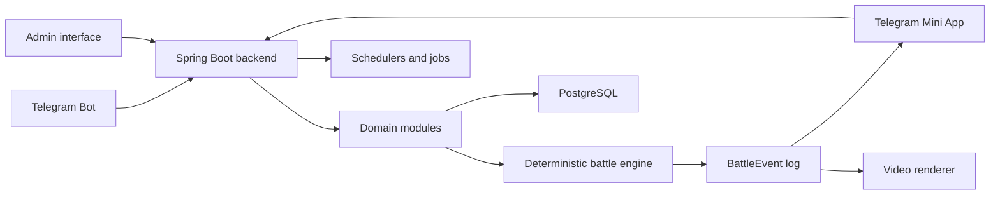

# Frontline Nations

Frontline Nations is a Telegram-first asynchronous military strategy game in which players complete short daily operations and contribute resources to weekly alliance fronts.

The repository contains a command-only MVP bot backed by Kotlin, Spring Boot, and PostgreSQL. The broader target product and architecture are described in [Documents/Frontline_TZ_v0.1_RU.docx](Documents/Frontline_TZ_v0.1_RU.docx). Mini App functionality is intentionally deferred.


## Play

Open [@frontline_nations_bot](https://t.me/frontline_nations_bot) and use:

- `/start` — register and choose an alliance with inline buttons
- `/battle` — choose one of three operations, inspect intelligence, and select a tactic
- `/profile` — inspect alliance, level progress, battle record, resources, and daily orders
- `/front` — inspect the current weekly contribution table
- `/contribute 100` — transfer Credits to the alliance front
- `/help` — show command help

## Product Principles

- A normal play session should produce a complete result in 1–3 minutes.
- Strategic depth comes from unit composition, modules, doctrines, tactics, and campaign allocation rather than real-time micromanagement.
- Personal progression contributes to a weekly alliance war, while matchmaking, NPC garrisons, and contribution modifiers keep smaller alliances viable.
- Battles are calculated on the server. Replays visualize an immutable event log and never determine the result.
- Balance values, schedules, units, battlefields, rewards, and other content are data-driven.
- The system should scale without simulating every campaign unit as a real-time physical entity.

## Planned Experience

### Daily operations

Players receive a limited number of Combat Orders, choose one of several operations, select a saved combat group and tactic, and receive an immediate deterministic result. Operations award commander XP, credits, research points, and materials.

### Weekly campaigns

From Monday through Saturday, players manufacture and contribute expendable campaign assets to their alliance. Contributions lock before the weekly battle. On Sunday, the server resolves an aggregated battle, publishes results, distributes rewards, and exposes a replay and optional video highlights.

### Progression

The planned progression model combines commander levels, a branching research tree, configurable unit modules, active doctrine perks, reusable combat-group presets, and seasonal prestige that does not create unlimited combat power.

## Target Architecture



The MVP currently uses:

- Kotlin and Spring Boot backend
- PostgreSQL 16+ persistence
- Telegram Bot commands and inline flows
- Docker Compose for local and production-like environments

The diagram also shows the planned Mini App, admin interface, replay stream, and optional renderer; those components are not part of the command-only MVP.

See [DOCUMENTATION.md](DOCUMENTATION.md) for module boundaries and data flow.

## Planned Repository Layout

```text
src/           Spring Boot application, migration, and tests
compose.yml    Application and PostgreSQL containers
scripts/       Telegram and deployment helpers
assets/        Brand assets, including the Telegram avatar
docs/          Product, architecture, and repository guidance
Documents/     Source specifications and retained project materials
```

Mini App and replay-renderer directories will be added only when those milestones begin.

## Documentation

- [Product overview](docs/product-overview.md)
- [Architecture](DOCUMENTATION.md)
- [Architecture baseline decision](docs/decisions/0001-architecture-baseline.md)
- [Contributor guide](CONTRIBUTING.md)
- [Agent guide](AGENTS.md)
- [GitHub About metadata](docs/github-about.md)
- [Source specification](Documents/Frontline_TZ_v0.1_RU.docx)

## Development Status

Current phase: command-only MVP with an interactive battle loop.

The current implementation proves registration, alliance selection, daily orders, three deterministic operation offers, risk/reward and intelligence trade-offs, five tactical orders, multi-round battle logs, transactional rewards, commander levels and battle statistics, resource contribution, and weekly alliance standings. Combat-group composition, research spending, campaign resolution, full replay UI, Mini App, and video rendering remain planned.

Run tests with `GRADLE_USER_HOME="$PWD/.gradle-home" ./gradlew test`. For a local Docker run, copy `.env.example` to an ignored `.env`, replace every secret, create the PostgreSQL data directory, and run `docker compose up --build`.

Production is published at [frontline-nations.tg-games.com](https://frontline-nations.tg-games.com). See [the Home Data Center runbook](docs/production/home-data-center.md).

## License

Licensed under the [Apache License 2.0](LICENSE).
