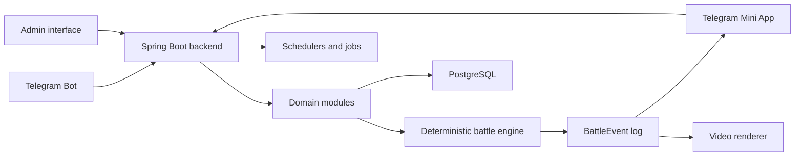

# Frontline Nations

Frontline Nations is a Telegram-first asynchronous military strategy game in which players complete short daily operations and contribute resources to weekly alliance fronts.

The repository contains a command-only MVP bot backed by Kotlin, Spring Boot, and PostgreSQL. The broader target product and architecture are described in [Documents/Frontline_TZ_v0.1_RU.docx](Documents/Frontline_TZ_v0.1_RU.docx). Mini App functionality is intentionally deferred.


## Play

Open [@frontline_nations_bot](https://t.me/frontline_nations_bot) and use:

- `/start` — register and choose an alliance with inline buttons
- `/battle` — choose an operation, map entry, first objective, and behavior doctrine for the active group
- `/army` or `/hangar` — switch between three presets and select currently available equipment within the CP limit through stable paired `− / +` controls
- `/shop` — inspect illustrated equipment cards and buy units for Credits without leaving the arsenal flow
- `/stars` — buy one of five fixed Credit packages through a native Telegram Stars invoice
- `/paysupport` — list refundable Stars purchases or send a refund request to support
- `/upgrade` — improve an owned unit from level 1 to 5
- `/daily` — claim 90–180 Credits, grow a 100-day streak, and receive a random unlocked unit at the maximum streak
- `/profile` — inspect alliance, level progress, battle record, resources, capacity, and reward streak
- `/front` — inspect the current matchup, intelligence, countdown, or published result
- `/contribute` — send, inspect, replace, or withdraw any of the three groups before the weekly lock; choose a map-marked entry, first objective, and tactic for each
- `/rankings` — browse the paginated country standings or view the top 10 commanders and your own XP place
- `/guide` — read the concise paginated rules for battles, equipment, progression, the weekly front, scoring, and rewards
- `/country` or `/country Serbia` — browse 250 countries and territories or search by localized name/code
- `/language` — choose English, Russian, Spanish, Brazilian Portuguese, Arabic, Indonesian, Hindi, or Turkish
- `/nickname Commander` — choose a sanitized nickname after explicit confirmation
- `/settings` — open language and profile settings
- `/help` — show command help

Every newly completed personal battle includes a `▶️ Battle replay` button. The bot renders a deliberately paced square MP4 directly from the saved event log, showing formation movement, fire, losses, and objective control. Resolved weekly matchups expose the same button in `/front`.

New accounts infer their initial language from Telegram and receive language-relevant country suggestions. The explicit language selection is retained even when Telegram later sends another interface locale. Existing accounts keep Russian until they choose another language.

## Product Principles

- A normal play session should produce a complete result in 1–3 minutes.
- Strategic depth comes from unit composition, terrain, routes, weapon ranges, behavior doctrines, modules, and campaign allocation rather than real-time micromanagement.
- Personal progression contributes to a weekly alliance war, while matchmaking, NPC garrisons, and contribution modifiers keep smaller alliances viable.
- Battles are calculated on the server. Replays visualize an immutable event log and never determine the result.
- Balance values, schedules, units, battlefields, rewards, and other content are data-driven.
- The system should scale without simulating every campaign unit as a real-time physical entity.

## Planned Experience

### Personal operations

Players launch operations from `/battle`. The bot sends a pre-rendered 1,536×1,536 image of an upright rectangular 9×12 hex sector. Every named battlefield has its own deterministic terrain composition, authored deployment geometry, objective arrangement, and connected road network; fronts may run north–south, west–east, diagonally, from opposing corners, or across mixed edges. Generated forests, rivers, coasts, marshes, ridges, and deserts form readable tactical regions instead of a single repeated texture. Blue A–C and red X–Z deployment badges sit outside distinct edge cells, illustrated objectives are numbered, adjacent hexes are full-bleed, and a visibly blocked half-hex rim closes the field. The player orders the active group through an entry toward its first objective and selects a movement/target-priority doctrine. The deterministic engine moves individual units on the same offset grid shown in the image, resolves spotting and finite-range fire, and tracks multi-step objective capture and recapture for at most 48 steps. Personal-map movement is capped at four road hexes per step; slower classes move two or three, while any traversable difficult cell still permits at least one-hex progress. A battle ends when one side controls every objective or the opposing army is destroyed or routed. A standard first-tier win starts at 20 Credits and adds one Credit and 10 XP per enemy CP destroyed, making a full win against an equal 10 CP force worth about 30 Credits. Surviving equipment returns to its presets; units reduced to zero HP are removed from the usable inventory and recorded as battle losses.

`/daily` grants a recurring supply reward. Credits use a compact 1:100 denomination: day one grants 90 Credits, approximately three full starter-group replacement costs and enough loss coverage for roughly five equal-force operations once battle income is included. Consecutive claims grow smoothly to exactly 180 Credits on day 100. A missed UTC game day resets the streak. Day 100 and every consecutive day after it retain the maximum reward and add one deterministic random unit from the commander's unlocked catalog.

### Weekly campaigns

All 250 countries and territories enter 125 weekly pairings. With an empty table they are sorted by English name and paired adjacently; later rounds sort by cumulative battle rating, with English name as the stable tie-break. Contributions remain open until Sunday at 15:00 UTC.

Each country receives a deterministic random NPC group whose actual equipment fits the first 10–25 CP category. Players may reinforce their country with any or all three personal presets, provided a concrete owned unit is not reused between them. Each contribution keeps its own edge entry and behavior doctrine; the weekly engine preserves the preset as a distinct formation source so those orders remain effective. Committed machines are reserved until withdrawal or resolution and cannot simultaneously enter a personal battle; surviving units return and destroyed units are removed. Each matchup uses one of ten individually composed, versioned 15×21 rectangular hex maps with a distinct front orientation, three edge entries per side, a unique five-objective arrangement, multiple terrain regions, and a connected road network with alternate routes. Formations move across exactly the grid shown in the image and use finite weapon ranges; artillery can fire indirectly, while aircraft still cannot strike across the whole map. A captured point grants more score when secured early. Losing it removes its retained score, and a later recapture is worth less. Destroyed enemy power and surviving allied power also score. Capturing all five points or destroying the opposing army ends the battle early; at the 96-turn limit, remaining force decides the winner first. Rating accumulates each side's battle score instead of replacing it. `/rankings` exposes that table in pages of ten and also shows the global commander XP top 10 plus the requesting player's place. A contributing winner receives a 90-Credit/600-XP base reward—about three ordinary equal-force victories—plus personal bonuses for formations destroyed and objectives captured. The winning country then earns ×1.2 Credits and XP from personal battles and `/daily` for seven days.

After resolution, every reachable commander in either participating country receives that country's result and the generated battle replay, even without a personal contribution. The result is persisted once per matchup, and one shared replay artifact is prepared for all recipients instead of reading and rendering it per player. Weekly MP4s remain in a persistent cache for at least 168 hours, including across container replacement. Resolution, replay rendering, and one-at-a-time outbox delivery run on a dedicated worker so bot commands remain responsive. Permanent Telegram delivery rejection marks the account unreachable and suppresses later broadcasts until a new inbound update proves the player reachable again.

Front orders use the same visible entry markers (`A`–`C` or `X`–`Z`) and numbered objectives (`1`–`5`) as the weekly map image. Each new contribution stores its first objective as well as its entry and doctrine. Contributions created before objective selection was introduced remain valid and use the deterministic automatic-target fallback.

### Progression

The command shop also offers fixed packs of 100/500/2,500/5,000/10,000 Credits for 20/85/350/600/1,000 Telegram Stars. Value rises by roughly 20% between adjacent tiers, and the largest pack delivers twice as many Credits per Star as the starter pack. Telegram validates the native `XTR` payment; the server binds its invoice to the player, checks pack and amount at pre-checkout, and credits a Telegram charge only once. `/paysupport` forwards refund requests to a private admin chat, and an approved Telegram refund reverses the full Credit grant even if that creates Credit debt.

The command MVP now includes seven configurable equipment classes, individual owned units, three reusable combat-group presets, commander-level unlocks, Credit purchases, and five unit levels. Materials are reserved for upgrades. Every class has map movement, sight, minimum/maximum weapon range, and a fire mode in addition to its five combat statistics. Aircraft movement remains finite; attack aircraft and fighters cannot strike across the whole map. Every level adds 12% to the unit's five base statistics.

New commanders receive the specification's 10 CP starter group: two main battle tanks, one artillery unit, and one reconnaissance vehicle. Capacity follows commander level directly: level 1 provides 10 CP, level 2 provides 11 CP, and every further level adds 1 CP up to the supported 1,000 CP ceiling. Level `L` requires `1,000 × L` XP to reach the next level, so the successive costs are 1,000, 2,000, 3,000, and so on; `/profile` shows progress within the current level. Research Points and manual capacity purchases are retired. Battles are classified by actually deployed power: 10–25, 26–50, 51–100, 101–250, 251–500, and 501–1,000 CP. Large groups are simulated as homogeneous formations by equipment class, unit level, and weekly contributor, preserving tactical differences and personal attribution without creating hundreds of independent map actors. Modules, branching technology choices, doctrine perks, repairs, and seasonal prestige remain planned.

## Target Architecture



The MVP currently uses:

- Kotlin and Spring Boot backend
- PostgreSQL 16+ persistence
- Telegram Bot commands and inline flows
- Docker Compose for local and production-like environments

The command MVP implements the replay/video path inside the Spring Boot container with FFmpeg. The diagram also shows the planned Mini App and admin interface; a separately scalable renderer remains an optional later extraction.

See [DOCUMENTATION.md](DOCUMENTATION.md) for module boundaries and data flow.

## Planned Repository Layout

```text
src/           Spring Boot application, migration, and tests
compose.yml    Application and PostgreSQL containers
scripts/       Telegram and deployment helpers
assets/        Brand assets and generated source atlases
src/main/resources/static/assets/units/  Generated equipment-class icons
src/main/resources/static/assets/maps/   Generated terrain/object blocks and immutable square battle-map PNGs
docs/          Product, architecture, and repository guidance
Documents/     Source specifications and retained project materials
```

Mini App and a separately deployed replay-renderer directory will be added only when those milestones begin; the current renderer lives in the modular monolith.

## Documentation

- [Product overview](docs/product-overview.md)
- [Architecture](DOCUMENTATION.md)
- [Architecture baseline decision](docs/decisions/0001-architecture-baseline.md)
- [Localized identity and alliance catalog decision](docs/decisions/0004-localized-identity-and-alliance-catalog.md)
- [Personal equipment and tactical composition decision](docs/decisions/0005-personal-equipment-and-tactical-composition.md)
- [Spatial personal battles decision](docs/decisions/0006-spatial-personal-battles.md)
- [Command capacity and force tiers decision](docs/decisions/0007-command-capacity-and-force-tiers.md)
- [Ranked spatial weekly campaigns decision](docs/decisions/0008-ranked-spatial-weekly-campaigns.md)
- [Graphical hex-map delivery decision](docs/decisions/0009-graphical-hex-map-delivery.md)
- [Rectangular tactical-map geometry decision](docs/decisions/0011-rectangular-tactical-map-geometry.md)
- [Destructive equipment and daily economy decision](docs/decisions/0010-destructive-equipment-and-daily-economy.md)
- [Progressive XP and compact campaign economy decision](docs/decisions/0012-progressive-xp-and-compact-campaign-economy.md)
- [Event-log video replay decision](docs/decisions/0013-event-log-video-replays.md)
- [Asynchronous campaign delivery decision](docs/decisions/0015-asynchronous-campaign-delivery.md)
- [Contributor guide](CONTRIBUTING.md)
- [Agent guide](AGENTS.md)
- [GitHub About metadata](docs/github-about.md)
- [Source specification](Documents/Frontline_TZ_v0.1_RU.docx)

## Development Status

Current phase: command-only MVP with persistent equipment progression, spatial personal operations, and ranked spatial weekly battles.

The current implementation proves localized registration and settings, campaign-level referral attribution, a versioned 250-entry country/territory catalog, moderated nicknames, a seven-class equipment catalog, transactional bulk purchases/upgrades, three CP-limited presets, level-derived command capacity, six battle categories up to 1,000 CP, spatial personal battles with permanent equipment casualties, a ledger-backed 100-day daily reward loop, five operation offers drawn from 24 battlefields with 24 mapped variants, 125 rating-seeded weekly pairings on ten larger maps, a random 10–25 CP NPC equipment group for every country, reserved and destructible player reinforcement, timed aggregate spatial resolution, capture/destruction/survival scoring, idempotent campaign rewards, staged country-wide Telegram result/replay delivery, and on-demand MP4 playback for personal and weekly battles. Prometheus metrics and an importable Grafana dashboard cover registrations by concrete referral code, player activity, commands, purchases, equipment actions, battles, and runtime health. Seasonal alliance switching, modules, typed campaign assets, branching technologies, and the Mini App remain planned.

Run tests with `GRADLE_USER_HOME="$PWD/.gradle-home" ./gradlew test`. For a local Docker run, copy `.env.example` to an ignored `.env`, replace every secret, create the PostgreSQL data directory, and run `docker compose up --build`.

Production is published at [frontline-nations.tg-games.com](https://frontline-nations.tg-games.com). See [the Home Data Center runbook](docs/production/home-data-center.md).

## License

Licensed under the [Apache License 2.0](LICENSE).
